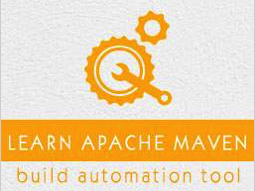

```
Roberto Nogueira  
BSd EE, MSd CE
Solution Integrator Experienced - Certified by Ericsson
```
# TutorialsPoint Maven



**About**

Learn everything you need to about the subject of this `Tutorialspoint` project.

[Homepage](https://www.tutorialspoint.com/maven/index.htm)

## Topics
```
Maven Tutorial
[ ] Home
[ ] Overview
[ ] Environment Setup
[ ] POM
[ ] Build Life Cycle
[ ] Build Profiles
[ ] Repositories
[ ] Plug-ins
[ ] Creating Project
[ ] Build & Test Project
[ ] External Dependencies
[ ] Project Documents
[ ] Project Templates
[ ] Snapshots
[ ] Build Automation
[ ] Manage Dependencies
[ ] Deployment Automation
[ ] Web Application
[ ] Eclispe IDE
[ ] NetBeans
[ ] IntelliJ IDEA
Maven Useful Resources
[ ] Questions and Answers
[ ] Quick Guide
[ ] Useful Resources
[ ] Discussion
Selected Reading
[ ] Developer's Best Practices
[ ] Questions and Answers
[ ] Effective Resume Writing
[ ] HR Interview Questions
[ ] Computer Glossary
[ ] Who is Who
```
